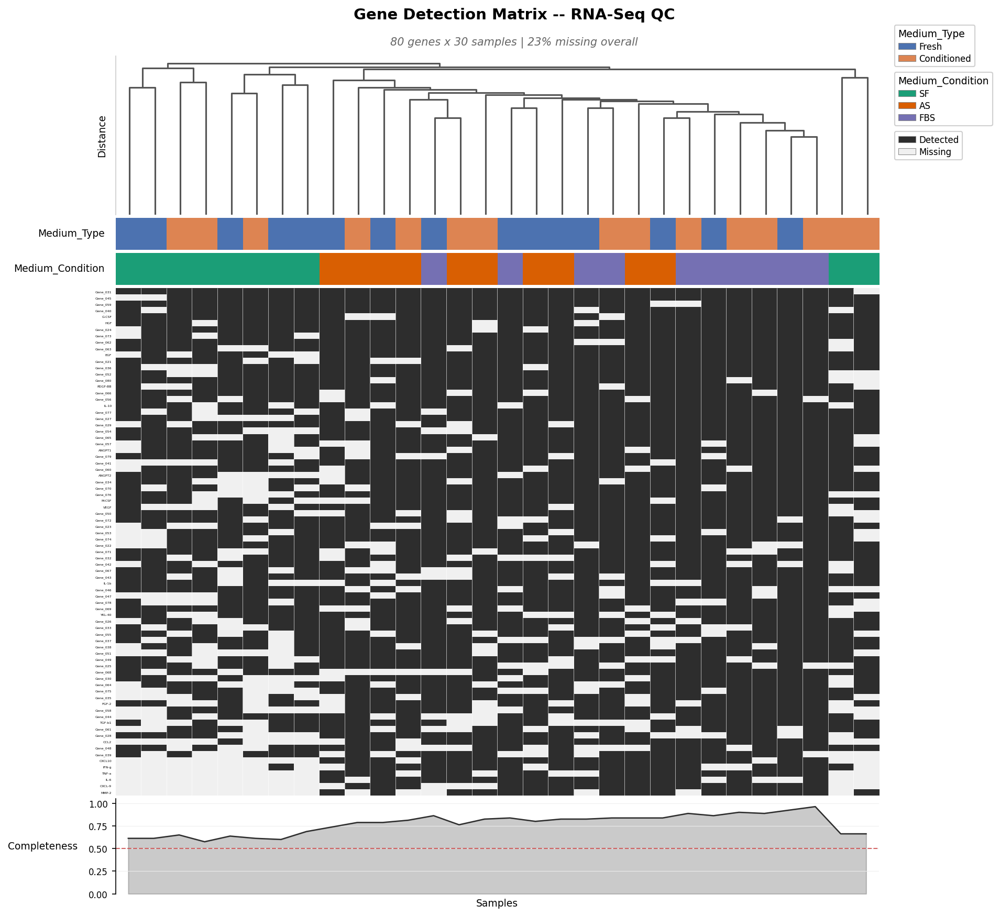
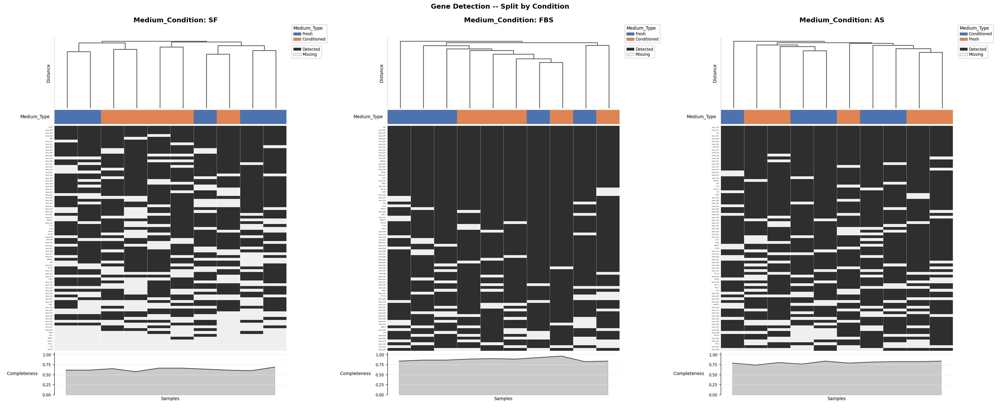

# mismap-qc

Missing-data matrix for RNA-Seq and proteomics QC. Shows which features (genes, proteins) are detected vs missing across samples, with hierarchical clustering and multi-level colour annotation strips for experimental metadata.



## Examples

- **[CPTAC Lung Adenocarcinoma proteomics](examples/cptac_proteomics.ipynb)** — real-world proteomics tutorial using public CPTAC LUAD data (~100 tumour/normal samples). Shows how missingness clusters by tumour/normal status and identifies potential QC outliers.

## Quick start

No virtual environment needed -- uses [PEP 723](https://peps.python.org/pep-0723/) inline script dependencies with [uv](https://docs.astral.sh/uv/).

```bash
uv run demo.py
```

Or import directly:

```python
import pandas as pd
from mismap_qc import missing_matrix

df = pd.read_csv("data/toy_rnaseq.csv", index_col=0, header=[0, 1, 2])
fig = missing_matrix(df, title="Gene Detection Matrix")
```

## Input format

A pandas DataFrame with:
- **Rows** = genes (or any features)
- **Columns** = samples, optionally as a `MultiIndex` for annotation strips
- **NaN** = missing / not detected

When columns are a MultiIndex, level names automatically become annotation strip labels.

## `missing_matrix()` -- static plot

```python
fig = missing_matrix(
    df,
    title="Gene Detection Matrix",
    subtitle="80 genes x 30 samples | 23% missing",
    save="output.png",
)
```

### Layout (top to bottom)

| Component | Description |
|---|---|
| Title + subtitle | Bold title, italic subtitle for metadata |
| Dendrogram | Hierarchical clustering of samples by nullity pattern |
| Annotation strips | One colour bar per MultiIndex column level |
| Nullity matrix | Dark = detected, light = missing |
| Completeness sparkline | Per-sample or per-gene detection rate |

### Parameters

#### Data & labels

| Parameter | Type | Default | Description |
|---|---|---|---|
| `df` | `DataFrame` | required | Genes (rows) x samples (columns). NaN = missing. |
| `title` | `str` | `""` | Bold figure title |
| `subtitle` | `str` | `""` | Italic line below title (e.g. dataset metadata) |
| `label_level` | `int` | `-1` | Which column level to use for x-axis tick labels |

#### Clustering & sorting

| Parameter | Type | Default | Description |
|---|---|---|---|
| `cluster_samples` | `bool` | `True` | Cluster samples by binary nullity pattern |
| `cluster_method` | `str` | `"average"` | scipy linkage method |
| `show_dendrogram` | `bool` | `True` | Show dendrogram above the matrix |
| `sort_genes` | `str \| None` | `"descending"` | Sort genes by completeness (`"ascending"`, `"descending"`, or `None`) |

#### Annotations

| Parameter | Type | Default | Description |
|---|---|---|---|
| `annotation_levels` | `list[int] \| None` | `None` | Column levels to show as colour bars (default: all except innermost) |
| `annotation_colors` | `dict \| None` | `None` | Custom colours per level (see below) |

Custom annotation colours accept level indices or names as keys:

```python
missing_matrix(
    df,
    annotation_colors={
        "Medium_Type": {"Fresh": "#88CCEE", "Conditioned": "#CC6677"},
        "Medium_Condition": {"SF": "#44AA99", "FBS": "#DDCC77", "AS": "#AA4499"},
    },
)
```

Unspecified factor levels fall back to built-in palettes.

#### Completeness sparkline

| Parameter | Type | Default | Description |
|---|---|---|---|
| `completeness` | `str` | `"below"` | `"below"` = per-sample (horizontal), `"side"` = per-gene (vertical) |
| `completeness_threshold` | `float \| None` | `None` | Draws a dashed red line at this value (0--1) |

#### Legends & layout

| Parameter | Type | Default | Description |
|---|---|---|---|
| `legend_loc` | `str` | `"upper right"` | Corner for legends: `"upper right"`, `"upper left"`, `"lower right"`, `"lower left"` |
| `figsize` | `tuple \| None` | `None` | Figure size (auto-calculated if `None`) |
| `color_present` | `str` | `"#2d2d2d"` | Colour for detected cells |
| `color_missing` | `str` | `"#f0f0f0"` | Colour for missing cells |

#### Font sizes

| Parameter | Type | Default | Description |
|---|---|---|---|
| `fontsize` | `int` | `10` | Base font size (fallback) |
| `fontsize_legend` | `int \| None` | `None` | Legend entries |
| `fontsize_rows` | `int \| None` | `None` | Gene/row labels |
| `fontsize_cols` | `int \| None` | `None` | Sample/column labels |
| `fontsize_annotations` | `int \| None` | `None` | Annotation strip labels |

#### Group summary

| Parameter | Type | Default | Description |
|---|---|---|---|
| `group_summary` | `int \| str \| None` | `None` | Column level to group by; prints per-group completeness to console |

```python
fig = missing_matrix(df, group_summary="Medium_Condition")
```

Output:

```
Group Completeness (Medium_Condition)
--------------------------------
  SF               63%  (n=10)
  AS               80%  (n=10)
  FBS              88%  (n=10)
```

Only prints when the level has more than one group.

#### Split by factor

| Parameter | Type | Default | Description |
|---|---|---|---|
| `split_by` | `int \| str \| None` | `None` | Split into side-by-side panels by this column level |

```python
fig = missing_matrix(df, split_by="Medium_Condition", annotation_levels=[0])
```



Each panel is independently clustered. The split level is automatically removed from annotation strips.

#### Output

| Parameter | Type | Default | Description |
|---|---|---|---|
| `save` | `str \| None` | `None` | Save figure to this path |
| `dpi` | `int` | `150` | Save resolution |

## `missing_matrix_html()` -- interactive HTML

Plotly-based interactive version with hover tooltips showing gene name, sample ID, all annotation levels, and detection status.

```python
from mismap_qc import missing_matrix_html

missing_matrix_html(
    df,
    title="Gene Detection Matrix (Interactive)",
    subtitle="80 genes x 30 samples",
    completeness_threshold=0.5,
    save="output/interactive.html",
)
```

Supports the same clustering, sorting, annotation, and completeness options as the static version. Additional parameters:

| Parameter | Type | Default | Description |
|---|---|---|---|
| `width` | `int \| None` | `None` | Plot width in pixels (auto-calculated if `None`) |
| `height` | `int \| None` | `None` | Plot height in pixels (auto-calculated if `None`) |

Requires `plotly` (`pip install plotly` or included via PEP 723 in demo.py).

## Generating toy data

```bash
uv run make_toy_data.py
```

Creates `data/toy_rnaseq.csv`: 80 genes x 30 samples with structured missingness patterns across 6 groups (Fresh/Conditioned x SF/FBS/AS).

## Dependencies

- numpy
- matplotlib
- scipy
- pandas
- plotly (optional, for HTML export only)
