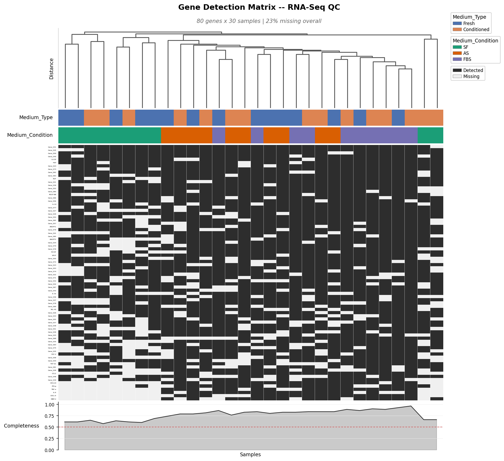
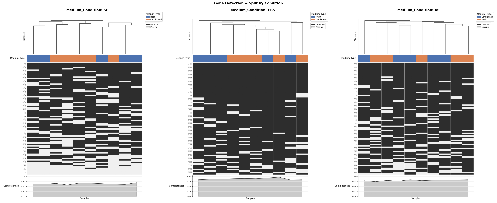
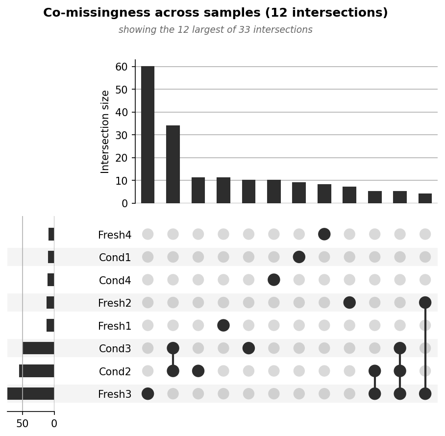

# mismap-qc

[](https://pypi.org/project/mismap-qc/)
[](https://pypi.org/project/mismap-qc/)
[](LICENSE)
[](https://github.com/foertsch/mismap-qc/actions/workflows/tests.yml)
[](https://foertsch.github.io/mismap-qc/)
[](https://hits.sh/github.com/foertsch/mismap-qc/)

Missing-data validation for proteomics and RNA-Seq experiments. Detects outlier
samples, classifies dropout mechanism (MNAR vs MAR), tests for batch effects,
and gates pipelines on configurable QC rules. Every check has a matching plot
for when you want to see the problem rather than just check it.

**Documentation: [foertsch.github.io/mismap-qc](https://foertsch.github.io/mismap-qc/)**

## Install

```bash
pip install mismap-qc
```

Optional extras: `[interactive]` for HTML matrices (plotly), `[anndata]` for
AnnData input.

## Quick start

```python
import pandas as pd
from mismap_qc import qc, assert_qc

df = pd.read_csv("proteomics.tsv", sep="\t", index_col=0)

# 1. Inspect: full QC report in one call
report = qc(df, group_level="condition")
print(report)
# MismapReport(n=8412x96, 3 outliers, 412 MNAR features, passed=True)

# 2. Drill in on anything flagged (the report holds pandas DataFrames)
report.sample_outliers.query("flagged")
report.feature_mechanism.query("mechanism == 'MNAR'")

# 3. Gate a pipeline (raises MismapQCFailure on rule violation)
assert_qc(df, thresholds={
    "min_sample_completeness": 0.60,
    "max_mnar_fraction": 0.30,
    "max_sample_outliers": 3,
})
```

For a human-readable multi-section summary instead of the one-line repr:

```python
print(report.summary())
```

Starting from an AnnData object:

```python
from mismap_qc import from_anndata, qc
df = from_anndata(adata, obs_levels=["batch", "condition"])
report = qc(df, group_level="condition")
```

To pair any plot with its underlying numbers, pass `return_data=True`:

```python
from mismap_qc import detection_waterfall
fig, table = detection_waterfall(df, return_data=True)
# table: feature, detection_rate, rank
```

## What this validates

| Check | What it catches |
|---|---|
| Sample completeness | Samples with too few detected features |
| Outlier detection | Samples with anomalous missingness vs group peers |
| Missingness mechanism | Dropouts driven by low abundance (MNAR) vs random (MAR) |
| Batch effects | Features whose detection differs between conditions |
| Run order drift | Instrument degradation over a long acquisition |



## Why use this

mismap-qc fills a specific gap in the Python omics ecosystem:

- `missingno` does general missing-data visualization but has no omics awareness
  (groups, MultiIndex sample annotations, MNAR mechanism).
- `protti` (R) classifies missingness mechanism but has no Python equivalent.
- `great-expectations` validates tabular data but does not understand
  missingness mechanism or omics-specific patterns.

mismap-qc handles all three with a single API and reads AnnData natively.

## Examples

- **[CPTAC Lung Adenocarcinoma proteomics](examples/cptac_proteomics.ipynb)** --
  real-world tutorial using public CPTAC LUAD data (~100 tumour/normal samples).
  Shows how missingness clusters by tumour/normal status.

## Running the demo

No virtual environment needed -- the demo uses [PEP 723](https://peps.python.org/pep-0723/) inline script dependencies with [uv](https://docs.astral.sh/uv/):

```bash
uv run demo.py
```

## Feature types

The `feature_type` parameter controls labels in axes and tooltips:

| Value | Labels |
|-------|--------|
| `"PROT"` | Protein / Proteins (default) |
| `"GENE"` | Gene / Genes |
| `"PEPTIDE"` | Peptide / Peptides |

## Input format

A pandas DataFrame with:
- **Rows** = features (proteins, genes, peptides)
- **Columns** = samples, optionally as a `MultiIndex` for annotation strips
- **NaN** = missing / not detected

When columns are a MultiIndex, level names automatically become annotation strip labels.

## `missing_matrix()` -- static plot

```python
fig = missing_matrix(
    df,
    title="Gene Detection Matrix",
    subtitle="80 genes x 30 samples | 23% missing",
    save="output.png",
)
```

### Layout (top to bottom)

| Component | Description |
|---|---|
| Title + subtitle | Bold title, italic subtitle for metadata |
| Dendrogram | Hierarchical clustering of samples by nullity pattern |
| Annotation strips | One colour bar per MultiIndex column level |
| Nullity matrix | Dark = detected, light = missing |
| Completeness sparkline | Per-sample or per-feature detection rate |

### Parameters

#### Data & labels

| Parameter | Type | Default | Description |
|---|---|---|---|
| `df` | `DataFrame` | required | Features (rows) x samples (columns). NaN = missing. |
| `title` | `str` | `""` | Bold figure title |
| `subtitle` | `str` | `""` | Italic line below title (e.g. dataset metadata) |
| `feature_type` | `str` | `"PROT"` | Feature type: `"PROT"`, `"GENE"`, or `"PEPTIDE"` |
| `label_level` | `int` | `-1` | Which column level to use for x-axis tick labels |

#### Clustering & sorting

| Parameter | Type | Default | Description |
|---|---|---|---|
| `cluster_samples` | `bool` | `True` | Cluster samples by binary nullity pattern |
| `cluster_method` | `str` | `"average"` | scipy linkage method |
| `show_dendrogram` | `bool` | `True` | Show dendrogram above the matrix |
| `sort_features` | `str \| None` | `"descending"` | Sort features by completeness (`"ascending"`, `"descending"`, or `None`) |

#### Annotations

| Parameter | Type | Default | Description |
|---|---|---|---|
| `annotation_levels` | `list[int] \| None` | `None` | Column levels to show as colour bars (default: all except innermost) |
| `annotation_colors` | `dict \| None` | `None` | Custom colours per level (see below) |

Custom annotation colours accept level indices or names as keys:

```python
missing_matrix(
    df,
    annotation_colors={
        "Medium_Type": {"Fresh": "#88CCEE", "Conditioned": "#CC6677"},
        "Medium_Condition": {"SF": "#44AA99", "FBS": "#DDCC77", "AS": "#AA4499"},
    },
)
```

Unspecified factor levels fall back to built-in palettes.

#### Completeness sparkline

| Parameter | Type | Default | Description |
|---|---|---|---|
| `completeness` | `str` | `"below"` | `"below"` = per-sample (horizontal), `"side"` = per-feature (vertical) |
| `completeness_threshold` | `float \| None` | `None` | Draws a dashed red line at this value (0--1) |

#### Legends & layout

| Parameter | Type | Default | Description |
|---|---|---|---|
| `legend_loc` | `str` | `"upper right"` | Corner for legends: `"upper right"`, `"upper left"`, `"lower right"`, `"lower left"` |
| `figsize` | `tuple \| None` | `None` | Figure size (auto-calculated if `None`) |
| `color_present` | `str` | `"#2d2d2d"` | Colour for detected cells |
| `color_missing` | `str` | `"#f0f0f0"` | Colour for missing cells |

#### Font sizes

| Parameter | Type | Default | Description |
|---|---|---|---|
| `fontsize` | `int` | `10` | Base font size (fallback) |
| `fontsize_legend` | `int \| None` | `None` | Legend entries |
| `fontsize_rows` | `int \| None` | `None` | Gene/row labels |
| `fontsize_cols` | `int \| None` | `None` | Sample/column labels |
| `fontsize_annotations` | `int \| None` | `None` | Annotation strip labels |

#### Group summary

| Parameter | Type | Default | Description |
|---|---|---|---|
| `group_summary` | `int \| str \| None` | `None` | Column level to group by; prints per-group completeness to console |

```python
fig = missing_matrix(df, group_summary="Medium_Condition")
```

Output:

```
Group Completeness (Medium_Condition)
--------------------------------
  SF               63%  (n=10)
  AS               80%  (n=10)
  FBS              88%  (n=10)
```

Only prints when the level has more than one group.

#### Split by factor

| Parameter | Type | Default | Description |
|---|---|---|---|
| `split_by` | `int \| str \| None` | `None` | Split into side-by-side panels by this column level |

```python
fig = missing_matrix(df, split_by="Medium_Condition", annotation_levels=[0])
```



Each panel is independently clustered. The split level is automatically removed from annotation strips.

#### Output

| Parameter | Type | Default | Description |
|---|---|---|---|
| `save` | `str \| None` | `None` | Save figure to this path |
| `dpi` | `int` | `150` | Save resolution |

## `missing_matrix_html()` -- interactive HTML

Plotly-based interactive version with hover tooltips showing feature name, sample ID, all annotation levels, and detection status.

```python
from mismap_qc import missing_matrix_html

missing_matrix_html(
    df,
    title="Gene Detection Matrix (Interactive)",
    subtitle="80 genes x 30 samples",
    completeness_threshold=0.5,
    save="output/interactive.html",
)
```

Supports the same clustering, sorting, annotation, and completeness options as the static version. Additional parameters:

| Parameter | Type | Default | Description |
|---|---|---|---|
| `width` | `int \| None` | `None` | Plot width in pixels (auto-calculated if `None`) |
| `height` | `int \| None` | `None` | Plot height in pixels (auto-calculated if `None`) |

Requires `plotly` (`pip install plotly` or included via PEP 723 in demo.py).

## Generating toy data

```bash
uv run make_toy_data.py
```

Creates `data/toy_rnaseq.csv`: 80 genes x 30 samples with structured missingness patterns across 6 groups (Fresh/Conditioned x SF/FBS/AS).

## Dependencies

- numpy
- matplotlib
- scipy
- pandas
- plotly (optional, for HTML export only)

## `missing_upset()` -- co-missingness intersections

Which *combinations* of samples share missing features. For each intersection, how many features are missing in exactly that combination and no others. At small n this is what separates technical dropout from biology: if two replicates always lose the same proteins together, that is not biology.

Requires `upsetplot` (`pip install mismap-qc[upset]`).

```python
from mismap_qc import missing_upset

fig, table = missing_upset(df, max_intersections=12, return_data=True)
```



The example above recovers two real patterns: `Fresh3` alone accounts for 60 features (one bad sample), and `Cond2|Cond3` shares 34 (a co-dropping pair).

| Parameter | Type | Default | Description |
|---|---|---|---|
| `by` | `str \| int` | `"sample"` | `"sample"` for one set per sample, or a column level name/index for one set per group |
| `group_min_frac` | `float` | `0.5` | Group mode only. A feature counts as missing in a group once it is missing in at least this fraction of the group's samples |
| `min_size` | `int` | `1` | Intersections smaller than this are not drawn |
| `max_intersections` | `int` | `50` | Draw at most this many intersections, largest first |
| `feature_type` | `str` | `"PROT"` | `"PROT"`, `"GENE"`, or `"PEPTIDE"` |
| `return_data` | `bool` | `False` | Return `(Figure, DataFrame)` |

Intersection count grows quickly with sample count, so the plot caps at the 50 largest by default. Truncation is stated on the figure ("showing the 12 largest of 33 intersections") and `return_data=True` still returns **every** intersection, with a `plotted` column marking what made the cut. Nothing is silently dropped.

Every feature with at least one missing value belongs to exactly one intersection, so the returned table has one row per feature:

| Column | Description |
|---|---|
| `feature` | Feature ID |
| `members` | The samples or groups it is missing in, pipe-joined (`"Cond2\|Cond3"`) |
| `n_features` | Size of that intersection |
| `rank` | Intersection rank by size, 1 = largest |
| `plotted` | Whether it survived `min_size` and `max_intersections` |

Which makes the follow-up question a one-liner:

```python
table.query("members == 'Cond2|Cond3'").feature   # proteins lost in exactly those two
```

Fully detected features carry no intersection information and are excluded.

## Contributing

Bug reports and pull requests are welcome. See [CONTRIBUTING.md](CONTRIBUTING.md) for the development install, how to run the tests and linter, and the conventions for adding a check or a plot. Participation is covered by the [Code of Conduct](CODE_OF_CONDUCT.md).

Development install:

```bash
git clone https://github.com/foertsch/mismap-qc.git
cd mismap-qc
uv sync --extra dev      # or: pip install -e ".[dev]"
```

## Citation

If you use mismap-qc in published work, please cite it. Machine-readable metadata is in [CITATION.cff](CITATION.cff); GitHub renders it as "Cite this repository" in the sidebar.

> Förtsch, A. (2026). *mismap-qc: missing-data validation for proteomics and RNA-Seq* (version 0.2.2). https://github.com/foertsch/mismap-qc

## Use of generative AI

Most of this package's code, tests, and prose was written by an AI coding agent working from my specifications and under my review. The design decisions and the responsibility are mine. The full disclosure, including what was and was not generated, is at [Use of generative AI](https://foertsch.github.io/mismap-qc/generative-ai-use/).

## License

MIT. See [LICENSE](LICENSE).
