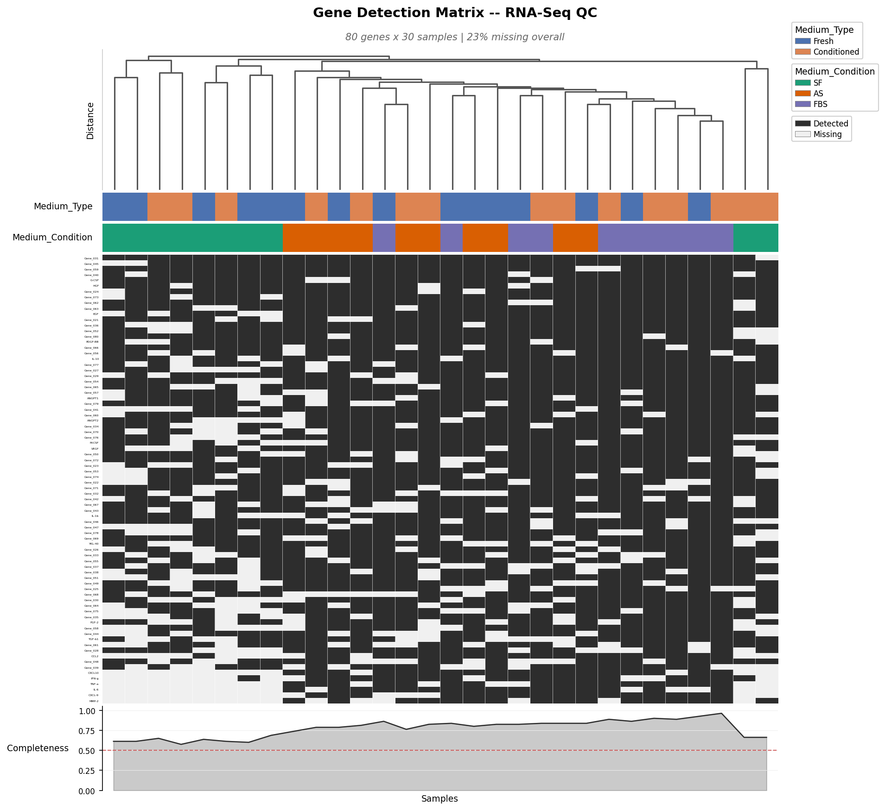
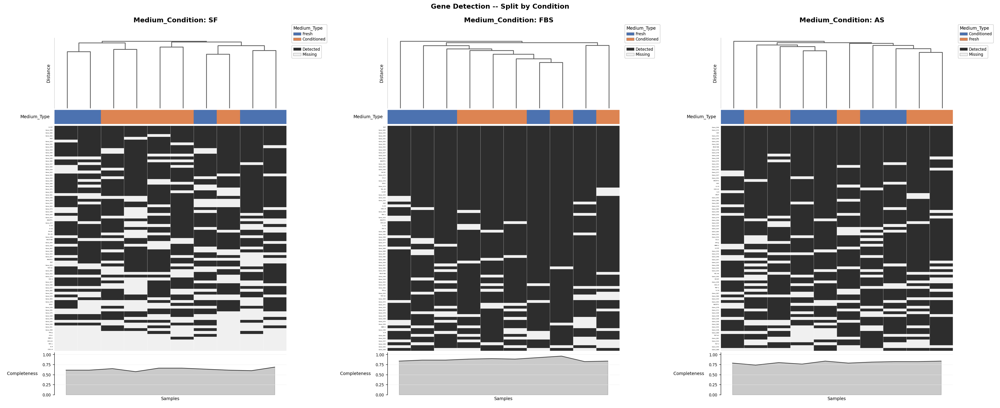
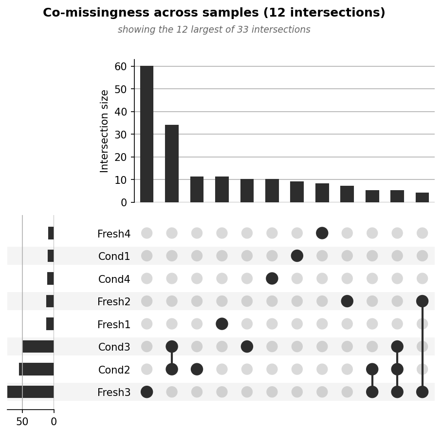

# mismap-qc

[](https://pypi.org/project/mismap-qc/)
[](https://pypi.org/project/mismap-qc/)
[](LICENSE)
[](https://github.com/foertsch/mismap-qc/actions/workflows/tests.yml)
[](https://foertsch.github.io/mismap-qc/)
[](https://codecov.io/gh/foertsch/mismap-qc)
[](https://hits.sh/github.com/foertsch/mismap-qc/)

Missing-data validation for proteomics and RNA-Seq experiments. Detects outlier
samples, classifies dropout mechanism (MNAR vs MAR), tests for batch effects,
and gates pipelines on configurable QC rules. Every check has a matching plot
for when you want to see the problem rather than just check it.

**Documentation: [foertsch.github.io/mismap-qc](https://foertsch.github.io/mismap-qc/)**

## Install

```bash
pip install mismap-qc
```

Optional extras: `[interactive]` for the HTML matrix (plotly), `[anndata]` for
AnnData input, `[upset]` for `missing_upset()` (upsetplot).

## Quick start

```python
import pandas as pd
from mismap_qc import qc, assert_qc

df = pd.read_csv("proteomics.tsv", sep="\t", index_col=0)

# 1. Inspect: full QC report in one call
report = qc(df, group_level="condition")
print(report)
# MismapReport(n=8412x96, 3 outliers, 412 MNAR features, passed=True)

# 2. Drill in on anything flagged (the report holds pandas DataFrames)
report.sample_outliers.query("flagged")
report.feature_mechanism.query("mechanism == 'MNAR'")

# 3. Gate a pipeline (raises MismapQCFailure on rule violation)
assert_qc(df, thresholds={
    "min_sample_completeness": 0.60,
    "max_mnar_fraction": 0.30,
    "max_sample_outliers": 3,
})
```

For a human-readable multi-section summary instead of the one-line repr:

```python
print(report.summary())
```

Starting from an AnnData object:

```python
from mismap_qc import from_anndata, qc
df = from_anndata(adata, obs_levels=["batch", "condition"])
report = qc(df, group_level="condition")
```

Seven of the ten plot functions pair with their underlying numbers through `return_data=True`. `missing_mechanism()` always returns `(Figure, DataFrame)`; `missing_abundance_density()` and `missing_matrix_html()` return a figure and an HTML string respectively.

```python
from mismap_qc import detection_waterfall
fig, table = detection_waterfall(df, return_data=True)
# table: feature, detection_rate, rank
```

## What this validates

| Check | What it catches |
|---|---|
| Sample completeness | Samples with too few detected features |
| Outlier detection | Samples with anomalous missingness vs group peers |
| Missingness mechanism | Dropouts driven by low abundance (MNAR) vs random (MAR) |
| Batch effects | Features whose detection differs between conditions |
| Run order drift | Instrument degradation over a long acquisition |



## Why use this

mismap-qc fills a specific gap in the Python omics ecosystem:

- `missingno` does general missing-data visualization but has no omics awareness
  (groups, MultiIndex sample annotations, MNAR mechanism).
- `protti` (R) classifies missingness mechanism but has no Python equivalent.
- `great-expectations` validates tabular data but does not understand
  missingness mechanism or omics-specific patterns.

mismap-qc handles all three with a single API and reads AnnData natively.

## Input format

A pandas DataFrame with:
- **Rows** = features (proteins, genes, peptides)
- **Columns** = samples, optionally as a `MultiIndex` for annotation strips
- **NaN** = missing / not detected

When columns are a MultiIndex, level names automatically become annotation strip labels.

## Feature types

The `feature_type` parameter controls labels in axes and tooltips:

| Value | Labels |
|-------|--------|
| `"PROT"` | Protein / Proteins (default) |
| `"GENE"` | Gene / Genes |
| `"PEPTIDE"` | Peptide / Peptides |

## Plots

Each check has a plot. Every parameter, with a runnable example, is in the [API reference](https://foertsch.github.io/mismap-qc/api/plots/).

| Function | Shows |
|---|---|
| `missing_matrix()` | Nullity matrix: samples clustered by missingness pattern, one annotation strip per MultiIndex level, a completeness sparkline |
| `missing_matrix_html()` | The same matrix as interactive HTML, with hover per cell (`[interactive]`) |
| `completeness_bars()` | Mean completeness per group |
| `completeness_violin()` | The per-sample distribution behind each group's mean, so one bad run stands out |
| `detection_waterfall()` | Features ranked by detection rate, with how many survive each filtering cutoff |
| `missing_runorder()` | Missing rate per sample against acquisition order, smoothed within each batch |
| `missing_mechanism()` | MNAR, MAR or INSUFFICIENT per feature, from a one-sided Mann-Whitney test |
| `missing_abundance_density()` | Mean abundance split by how often a feature is missing, the MNAR signature at a glance |
| `comissing_heatmap()` | How often pairs of features are missing together |
| `missing_upset()` | Which combinations of samples share missing features (`[upset]`) |

```python
from mismap_qc import missing_matrix

fig = missing_matrix(df, split_by="Medium_Condition", annotation_levels=[0])
```



`missing_upset()` answers the small-n question of whether dropout is technical. On synthetic data with two injected patterns it recovers both: `Fresh3` alone accounts for 60 missing features (one bad sample), and `Cond2|Cond3` share 34 (a pair that drops out together).



## Examples

- **[CPTAC Lung Adenocarcinoma proteomics](examples/cptac_proteomics.ipynb)**: real-world tutorial on public CPTAC LUAD data (~100 tumour/normal samples). Shows how missingness clusters by tumour/normal status.
- **Demo script:** `uv run demo.py` renders the full plot set. It declares its dependencies inline ([PEP 723](https://peps.python.org/pep-0723/)), so no virtual environment is needed.
- **Toy data:** `uv run make_toy_data.py` writes `data/toy_rnaseq.csv`, 80 genes x 30 samples with structured missingness across six groups (Fresh/Conditioned x SF/FBS/AS).

## Contributing

Bug reports and pull requests are welcome. See [CONTRIBUTING.md](CONTRIBUTING.md) for the development install, how to run the tests and linter, and the conventions for adding a check or a plot. Participation is covered by the [Code of Conduct](CODE_OF_CONDUCT.md).

Development install:

```bash
git clone https://github.com/foertsch/mismap-qc.git
cd mismap-qc
uv sync --extra dev      # or: pip install -e ".[dev]"
```

## Citation

If you use mismap-qc in published work, please cite it. Machine-readable metadata is in [CITATION.cff](CITATION.cff); GitHub renders it as "Cite this repository" in the sidebar.

> Förtsch, A. (2026). *mismap-qc: missing-data validation for proteomics and RNA-Seq* (version 0.4.1). https://github.com/foertsch/mismap-qc

## Use of generative AI

Most of this package's code, tests, and prose was written by an AI coding agent working from my specifications and under my review. The design decisions and the responsibility are mine. The full disclosure, including what was and was not generated, is at [Use of generative AI](https://foertsch.github.io/mismap-qc/generative-ai-use/).

## License

MIT. See [LICENSE](LICENSE).
